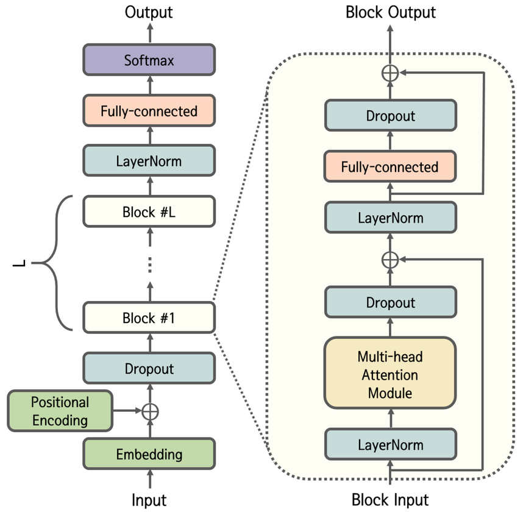

# Baby GPT

## Overview
Baby GPT is a simple implementation of a Generative Pre-trained Transformer (GPT) model. It is designed to be easy to understand and modify, making it a great starting point for those interested in learning about transformer models and natural language processing.

This is inspired greatly by the work of Andrej Karpathy and his [minGPT](https://github.com/karpathy/nanoGPT)

## How to Use

### To train the model:
1. Install the required packages
2. Run the training script:
```bash
python train.py
```

### To generate text:
1. Install the required packages
2. Run the generation script:
```bash
python inference.py
```

## Model Architecture


